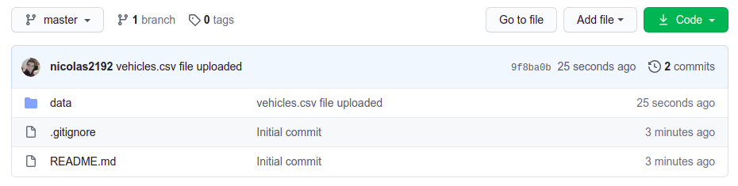

# My very first repository!

After succeeding at a challenging hiring process, you landed a job as a data analyst for **[Nikola Motor Company](https://nikolamotor.com)** - Congratulations!

Now, as your first task, you have been told to give some valuable insights concerning the vehicles dataset. The one you have already worked with.

You will have to do so by following these steps:

- Create a new repository on your GitHub called `vehicles_insight`. 
- Clone your brand new `vehicles_insight` repo to your machine.
- Create a python script and name it `vehicles.py`.
- Update `README.md` file
- Update repo in Github. 

#### 1- New project = New repository

Nikola follows strict rules when it comes to new developments. As you have been told, you need to create a new repository every time you are creating something from scratch. Let's make a new repository on your GitHub account and call it **"vehicles_insight"**. This repo should host the raw data in a folder named "data" as well as the main script.

Don't forget to add a `.gitignore` and an explanatory `README.md` !!

It would be something like this:

#### 2- Clone it to your local machine

Once you have your online repo all set, clone it to your local machine. You may use the git clone command here.

Your local folder should have these files:

#### 3- Add some code!

You have been asked to create a new function that takes the vehicle's data frame as an argument and prints its shape. Feel free to code it using Jupyter but remember that your deliverable should be a python script called **"vehicles.py"**. It should run on the terminal printing the data frame's shape. - your boss will check your work by doing exactly that!

Check the Calculator.py or simple_script.py for guidelines on how to create a function and a python script. 

You should get something like this by running it on the terminal:

#### 4- Upload it to the cloud!

Push it to your online repository once it is done. Your boss will clone it and test it from its terminal. Double-check it works!

#### 5- First impression matters!

Update the readme.md file. 

Write what the repo is about, the script's functionalities, and how to use it. Keep it simple and straightforward but remember this will be the first thing your boss - or future employer - will see.

You might find these links useful: [here](https://medium.com/@meakaakka/a-beginners-guide-to-writing-a-kickass-readme-7ac01da88ab3) and [here](https://github.com/potacho/data-project-template).

Your repo should look like this:

#### BONUS - Prove what you are made of! :smirk:

Start with the bonus only if you have already gone through all previous steps!

You want to show off a little so you have decided to add additional features to the original script.

Feel free to add as many as you want! Here is a list of possible things you could implement. 

- Number of rows.
- Column's name.
- Column's type.
- Amount of Null values per column.
- Minimun and maximun value (numerical columns).

